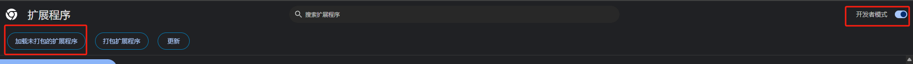
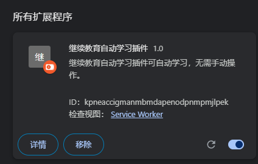
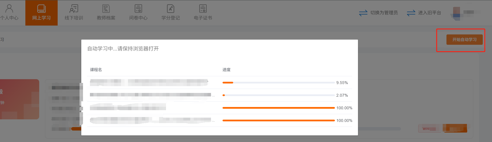

# 一个继教网视频自动学习的浏览器插件

# 使用说明

- 打包下载源码
- 在Chrome和Edge浏览器插件扩展页面开启开发者模式，然后加载该插件
- 
- 
- 将要学习得课程选好后
- 在【我的学习】页面点击【开始自动学习】按钮，即可自动学习
- 

# 免责声明

本插件仅供学习和研究用途，旨在提升继续教育网站的使用效率。使用本插件产生的所有后果由用户自行承担。插件开发者不对因使用本插件导致的任何账号封禁、学习记录异常、平台政策冲突等后果负责。

请遵守相关网站的服务条款与国家法律法规，合理使用本工具。若您为平台方或版权方，对本插件有任何异议，请联系开发者删除或修改相关功能。